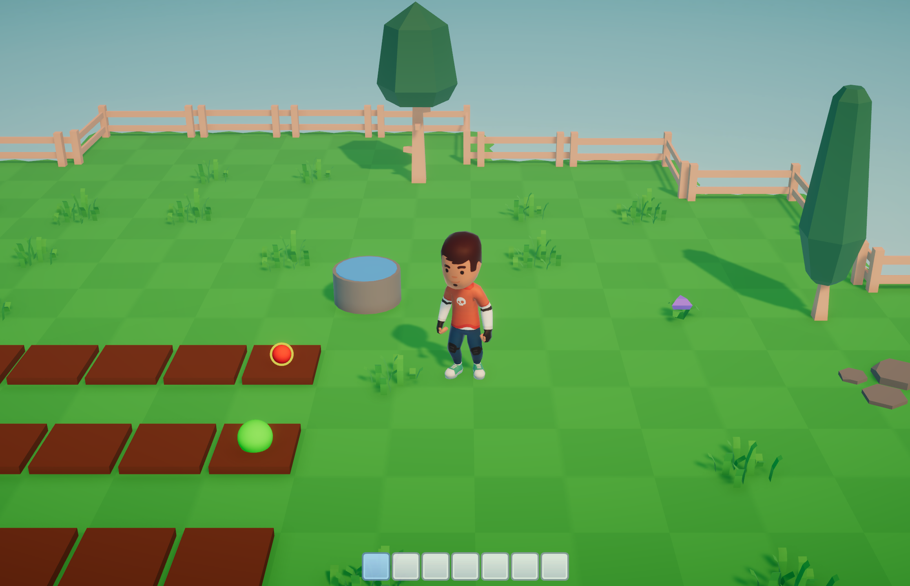

# FarmingGame
The final project game for NKKM

### The Goal

Save all 4 sick villagers before their health bars hit 0%. If any villager dies, it is Game Over.

- Plant seeds and harvest the colored fruits.

- Mix fruits in the cauldron to match the color the villager wants.

- Give the potion to the villager to cure them.

### Controls

 Move: `W A S D`

Interact (Plant / Harvest / Mix / Cure): `E`

Switch Selected Item: `Mouse Scroll Wheel`